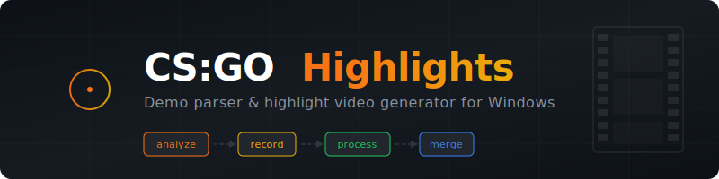

<p align="center">
  
</p>

<p align="center">
  <a href="https://github.com/yarikleto/cs-go-highlights/blob/main/LICENSE"></a>
  
  
  
</p>

<p align="center">
  Automatically detect and record impressive gameplay moments from CS:GO demo files.<br/>
  Drop your <code>.dem</code> files in, get a polished highlight video out — complete with speedup, slow motion, player overlays, and background music.
</p>

---

## Features

- **Automatic detection** of kill series, aces, clutches, knife kills, collaterals, one-taps, and flick shots
- **Video recording** via HLAE with automatic CS:GO configuration
- **Post-processing** — speedup between kills, slow motion on headshots, player name overlays
- **Background music** with per-clip timing control and fade in/out
- **Scoring system** to rank and select the most impressive highlights
- **Multi-step workflows** — run the full pipeline or individual steps from the UI

## Prerequisites

| Dependency | Description |
|------------|-------------|
| **[Node.js](https://nodejs.org/)** (v22.12+) | Runtime |
| **[FFmpeg](https://ffmpeg.org/)** | Video encoding — must be in PATH |
| **[HLAE](https://www.advancedfx.org/)** | Half-Life Advanced Effects — video capture |
| **CS:GO Legacy** | HLAE does not support CS2. Install via Steam: CS2 → Properties → Betas → `csgo_legacy` |

## Installation

```bash
git clone https://github.com/yarikleto/cs-go-highlights.git
cd cs-go-highlights
npm install
```

## Getting Started

Launch the desktop app:

```bash
npm run dev
```

This opens the Electron UI where you can:

1. **Configure paths** — set your demos folder, HLAE location, and CS:GO installation path in the Settings page
2. **Run workflows** — use the built-in pipelines (e.g., "Full Legacy Pipeline") to analyze demos, record clips, apply effects, and merge into a final video
3. **Browse highlights** — preview detected highlights, sort by map/score, and manage your clips
4. **Fine-tune music** — adjust music timing per clip in the Music Editor

## Typical Workflow

```
.dem files  →  Analyze  →  Record  →  Post-process  →  Merge  →  Final MP4
                  │           │            │              │
             detect       capture      speedup,       combine
            highlights    via HLAE     slowmo,        into one
                                      overlays        video
```

1. Place your `.dem` files in the demos folder
2. Run **Analyze** to detect highlights
3. Run **Record** to capture video clips via HLAE
4. Run **Post-process** to apply speedup, slow motion, and overlays
5. Run **Merge** to combine clips into a final video
6. (Optional) **Compress** the final video for sharing

The UI provides flow runners that chain these steps together automatically.

## Documentation

| Document | Description |
|----------|-------------|
| [CLI Commands](docs/cli-commands.md) | Full reference for all commands and options |
| [Highlight Types](docs/highlight-types.md) | Detection criteria and priority system |
| [Video Effects](docs/video-effects.md) | Speedup, slow motion, overlays, recording settings |
| [Music](docs/music.md) | Background music setup and fine-tuning |
| [Scoring](docs/scoring.md) | How highlights are ranked |
| [Output Format](docs/output-format.md) | `highlights.json` structure and configuration defaults |

## License

[MIT](LICENSE)
